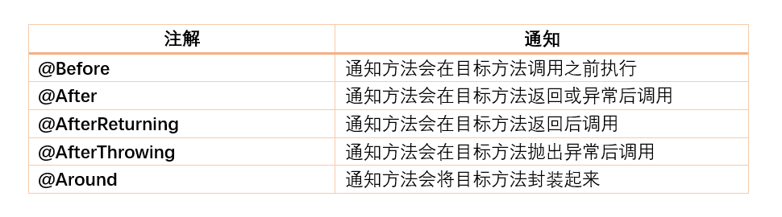
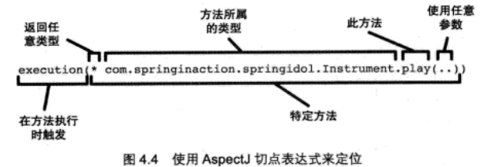
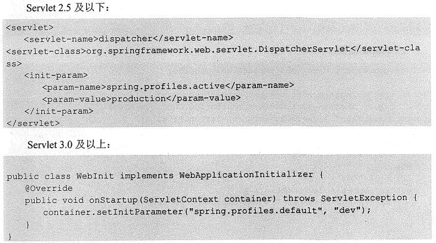

#### pom.xml
maven的pom.xml声明一个dependency的时候,如果scope设置为了runtime,则IDEA无法在写代码时给你提示一些代码,要将其注释掉才能用
#### aop
##### aop概念
1. join point:一个method的执行或 exception的 handle,spring-aop特指method的执行
2. pointcut:匹配一个method的执行
3. 通知(Advice): 描述对那些切点进行增强,以及如何增强 
4. 切面(Aspect): 切点+通知,比如我们声明的切面类 
5. 织入(weaving): 将增强处理添加到目标对象中的过程 
6. 引入(introduction): 给目标类增加新的功能
7. pointcut expression language:匹配joint point的表达式语言

参考:
1. [spring-aop-pointcut-tutorial](https://www.baeldung.com/spring-aop-pointcut-tutorial#:~:text=A%20pointcut%20expression%20can%20appear%20as%20a%20value,by%20advice%20annotations%20to%20refer%20to%20that%20pointcut.)
2. [Spring-Aop](https://www.cnblogs.com/joy99/p/10941543.html)
##### aop切点的切入方式

1. arg: 限制joint point的方法的参数为指定类型 @Pointcut("args(com.cbf.aop.arg_example.ArgFlyInterface)")
2. @args: 限制joint point的方法的参数具有指定类型的注解 @Pointcut("@args(com.cbf.aop.arg_annotation_example.ArgFlyAnnotation)")
3. execution:
   1. 具体指某个方法的执行 @Pointcut("execution(public String com.baeldung.pointcutadvice.dao.FooDao.findById(Long))")  
   2. 通配符,任意类的具有任意参数的任意方法 @Pointcut("execution(* com.baeldung.pointcutadvice.dao.FooDao.*(..))")
   3. 特定参数的方法
   @Pointcut("execution(* *..find*(Long))")
   @Pointcut("execution(* *..find*(Long,..))")
4. this/target: 限制joint point的方法所在类是指定类型
   1. @Pointcut("target(com.cbf.aop.target_example.TargetExampleInterface)")
   2. @Pointcut("this(com.cbf.aop.this_example.ThisExampleInterface)")
   3. within不生效
5. @target/@within: 限制joint point所在方法的类具有指定类型的注解
   1. @Pointcut("@target(com.cbf.aop.target_annotation_example.TargetAnnotation)")
   2. @Pointcut("@within(com.cbf.aop.within_annotation_example.WithinAnnotation)")
6. @annotation: 限制joint point方法有指定注解
   1. @Pointcut("@annotation(com.cbf.aop.excecution.Action)")
7. 依赖
   ```
           <dependency>
               <groupId>org.aspectj</groupId>
               <artifactId>aspectjrt</artifactId>
               <version>1.8.5</version>
           </dependency>
           <dependency>
               <groupId>org.aspectj</groupId>
               <artifactId>aspectjweaver</artifactId>
               <version>1.8.5</version>
           </dependency>
   ```
##### aop的通知类型

##### aop的execution详解

#### scope
scope描述Spring容器如何新建bean实例,使用@Scope注解来实现
1. Singleton:一个Spring容器只有一个Bean实例
2. Prototype: 每次调用新建一个Bean实例
3. Request: web项目,一个http request新建一个bean实例
4. Session: 一个http session新建一个bean实例

#### 资源注入
1. 使用EL-spring表达式,可用于xml、注解中,将 普通文件、网址、配置文件、系统环境变量等注入
2. 使用springboot时,会默认加载classpath下的application.properties默认,此时可以用@Value直接获取application.properties中的属性值
3. 在@Value的参数中使用表达式
   1. @Value("${property:default_value}") 注入外部配置文件对应的property, 为空时默认值为default_value
   2. @Value("#{obj.property:default_value}") 注入SpEL表达式对应的内容,obj是对象, 为空时默认值为default_value
4. @Value例子
   1. 注入普通字符串
5. @PropertySource
   1. 用classpath指定要加载的资源文件
   2. 用file指定要加载的资源文件
   3. spring4.3之前，除了使用@PropertySource注解之外，还要手动注册一个资源文件解析器PropertySourcesPlaceholderConfigurer到IOC容器中。并且如果使用Bean注解注册资源文件解析器，方法要是static方法,不然无法解析；spring4.3之后,可以直接使用，因为spring会使用默认的DefaultPropertySourceFactory解析。
   4. 自带的资源解析器可以解析properties、xml文件
   5. 自定义实现解析yaml解析

参考: [@PropertySource详解](https://blog.csdn.net/qq_40837310/article/details/106587158)

#### bean的初始化和销毁
1. 使用@Bean的initMethod、destroyMethod
2. 使用JSR-250的@PostConstruct、@PreDestroy

#### @ComponentScan
1. 默认扫描注解类的当前包以及sub-packages
2. 指定扫描包
```
@ComponentScan(basePackages = "com.baeldung.componentscan.springapp")
```
3. 指定多个扫描包
```
@ComponentScan(basePackages = {"com.baeldung.componentscan.springapp.animals", "com.baeldung.componentscan.springapp.flowers"})
```
// spring 4.1.1开始,可以用,或;或空格分割多个包
```
@ComponentScan(basePackages = "com.baeldung.componentscan.springapp.animals;com.baeldung.componentscan.springapp.flowers")
@ComponentScan(basePackages = "com.baeldung.componentscan.springapp.animals,com.baeldung.componentscan.springapp.flowers")
@ComponentScan(basePackages = "com.baeldung.componentscan.springapp.animals com.baeldung.componentscan.springapp.flowers")
```
4. 排除包
```
// 例子1
@ComponentScan(excludeFilters = @ComponentScan.Filter(type=FilterType.REGEX,
 pattern="com\\.baeldung\\.componentscan\\.springapp\\.flowers\\..*"))

// 例子2
ComponentScan(excludeFilters = 
  @ComponentScan.Filter(type = FilterType.ASSIGNABLE_TYPE, value = Rose.class))
```
5. @SpringBootApplication也有@ComponentScan功能,因为它由三个注解组成
```  
@Configuration
@EnableAutoConfiguration
@ComponentScan
```
参考: [@ComponentScan](https://www.baeldung.com/spring-component-scanning)

#### Profile
不同环境下使用不同配置,比如dev、uat、prod的database config肯定是不同的
设置方式:
   1. environment的activeProfiles来设定当前需要的配置环境,在开发中使用@Profile注解类或方法,达到不同情况下实例化不同的bean
   2. 设定jvm的spring.profiles.active设置环境
   3. web项目设置Servlet的context parameter 
   
