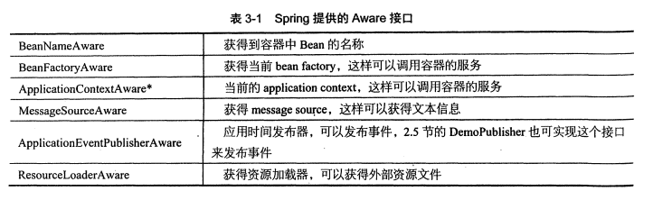

### spring-core
#### mvn将jar包打包本地maven库
```
   mvn install:install-file -DgroupId=com.oracle -DartifactId=ojdbc14 -Dversion=1.0 -Dpackaging=jar
   -Dfile=D:\ojdbc14.jar
```
#### bean
##### spring声明bean的注解: @Component、@Service、@Repository、@Controller功能上等效
1. @Component 没有明确角色
2. @Service 业务逻辑层(service)使用
3. @Repository 数据访问层(dao)使用
4. @Controller 展现层(mvc->spring mvc)使用
##### 注入bean的注解
1. @Autowired Spring提供的注解
2. @Inject JSR-330提供的注解
3. @Resource JSR-250提供的注解
4. @Autowired、@Inject、@Resource可以注解在set方法上或属性上,一般注解在属性上更好
##### java配置
使用@Configuraiton和@Bean实现:
   1. @Configuration声明当前类是一个配置类,相当于一个Spring配置的xml文件
   2. @Bean注解在方法上,声明当前方法的返回值为一个Bean
#### pom.xml
maven的pom.xml声明一个dependency的时候,如果scope设置为了runtime,则IDEA无法在写代码时给你提示一些代码,要将其注释掉才能用
#### aop
##### aop概念
1. join point:一个method的执行或 exception的 handle,spring-aop特指method的执行
2. pointcut:匹配一个method的执行
3. 通知(Advice): 描述对那些切点进行增强,以及如何增强 
4. 切面(Aspect): 切点+通知,比如我们声明的切面类 
5. 织入(weaving): 将增强处理添加到目标对象中的过程 
6. 引入(introduction): 给目标类增加新的功能
7. pointcut expression language:匹配joint point的表达式语言

参考:
1. [spring-aop-pointcut-tutorial](https://www.baeldung.com/spring-aop-pointcut-tutorial#:~:text=A%20pointcut%20expression%20can%20appear%20as%20a%20value,by%20advice%20annotations%20to%20refer%20to%20that%20pointcut.)
2. [Spring-Aop](https://www.cnblogs.com/joy99/p/10941543.html)
##### aop切点的切入方式

1. arg: 限制joint point的方法的参数为指定类型 @Pointcut("args(com.cbf.aop.arg_example.ArgFlyInterface)")
2. @args: 限制joint point的方法的参数具有指定类型的注解 @Pointcut("@args(com.cbf.aop.arg_annotation_example.ArgFlyAnnotation)")
3. execution:
   1. 具体指某个方法的执行 @Pointcut("execution(public String com.baeldung.pointcutadvice.dao.FooDao.findById(Long))")  
   2. 通配符,任意类的具有任意参数的任意方法 @Pointcut("execution(* com.baeldung.pointcutadvice.dao.FooDao.*(..))")
   3. 特定参数的方法
   @Pointcut("execution(* *..find*(Long))")
   @Pointcut("execution(* *..find*(Long,..))")
4. this/target: 限制joint point的方法所在类是指定类型
   1. @Pointcut("target(com.cbf.aop.target_example.TargetExampleInterface)")
   2. @Pointcut("this(com.cbf.aop.this_example.ThisExampleInterface)")
   3. within不生效
5. @target/@within: 限制joint point所在方法的类具有指定类型的注解
   1. @Pointcut("@target(com.cbf.aop.target_annotation_example.TargetAnnotation)")
   2. @Pointcut("@within(com.cbf.aop.within_annotation_example.WithinAnnotation)")
6. @annotation: 限制joint point方法有指定注解
   1. @Pointcut("@annotation(com.cbf.aop.excecution.Action)")
7. 依赖
   ```
           <dependency>
               <groupId>org.aspectj</groupId>
               <artifactId>aspectjrt</artifactId>
               <version>1.8.5</version>
           </dependency>
           <dependency>
               <groupId>org.aspectj</groupId>
               <artifactId>aspectjweaver</artifactId>
               <version>1.8.5</version>
           </dependency>
   ```
##### aop的通知类型

##### aop的execution详解

#### scope
scope描述Spring容器如何新建bean实例,使用@Scope注解来实现
1. Singleton:一个Spring容器只有一个Bean实例
2. Prototype: 每次调用新建一个Bean实例
3. Request: web项目,一个http request新建一个bean实例
4. Session: 一个http session新建一个bean实例

#### 资源注入
1. 使用EL-spring表达式,可用于xml、注解中,将 普通文件、网址、配置文件、系统环境变量等注入
2. 使用springboot时,会默认加载classpath下的application.properties默认,此时可以用@Value直接获取application.properties中的属性值
3. 在@Value的参数中使用表达式
   1. @Value("${property:default_value}") 注入外部配置文件对应的property, 为空时默认值为default_value
   2. @Value("#{obj.property:default_value}") 注入SpEL表达式对应的内容,obj是对象, 为空时默认值为default_value
4. @Value例子
   1. 注入普通字符串
5. @PropertySource
   1. 用classpath指定要加载的资源文件
   2. 用file指定要加载的资源文件
   3. spring4.3之前，除了使用@PropertySource注解之外，还要手动注册一个资源文件解析器PropertySourcesPlaceholderConfigurer到IOC容器中。并且如果使用Bean注解注册资源文件解析器，方法要是static方法,不然无法解析；spring4.3之后,可以直接使用，因为spring会使用默认的DefaultPropertySourceFactory解析。
   4. 自带的资源解析器可以解析properties、xml文件
   5. 自定义实现解析yaml解析

参考: [@PropertySource详解](https://blog.csdn.net/qq_40837310/article/details/106587158)

#### bean的初始化和销毁
1. 使用@Bean的initMethod、destroyMethod
2. 使用JSR-250的@PostConstruct、@PreDestroy

#### @ComponentScan
1. 默认扫描注解类的当前包以及sub-packages
2. 指定扫描包
```
@ComponentScan(basePackages = "com.baeldung.componentscan.springapp")
```
3. 指定多个扫描包
```
@ComponentScan(basePackages = {"com.baeldung.componentscan.springapp.animals", "com.baeldung.componentscan.springapp.flowers"})
```
// spring 4.1.1开始,可以用,或;或空格分割多个包
```
@ComponentScan(basePackages = "com.baeldung.componentscan.springapp.animals;com.baeldung.componentscan.springapp.flowers")
@ComponentScan(basePackages = "com.baeldung.componentscan.springapp.animals,com.baeldung.componentscan.springapp.flowers")
@ComponentScan(basePackages = "com.baeldung.componentscan.springapp.animals com.baeldung.componentscan.springapp.flowers")
```
4. 排除包
```
// 例子1
@ComponentScan(excludeFilters = @ComponentScan.Filter(type=FilterType.REGEX,
 pattern="com\\.baeldung\\.componentscan\\.springapp\\.flowers\\..*"))

// 例子2
ComponentScan(excludeFilters = 
  @ComponentScan.Filter(type = FilterType.ASSIGNABLE_TYPE, value = Rose.class))
```
5. @SpringBootApplication也有@ComponentScan功能,因为它由三个注解组成
```  
@Configuration
@EnableAutoConfiguration
@ComponentScan
```
参考: [@ComponentScan](https://www.baeldung.com/spring-component-scanning)

#### Profile
不同环境下使用不同配置,比如dev、uat、prod的database config肯定是不同的
设置方式:
   1. environment的activeProfiles来设定当前需要的配置环境,在开发中使用@Profile注解类或方法,达到不同情况下实例化不同的bean
   2. 设定jvm的spring.profiles.active设置环境
   3. web项目设置Servlet的context parameter 
   
##### springboot里使用profile
1. 对application-{env}的影响
2. 对application.properties中的其他profile的影响
#### 事件application event
1. application event为bean与bean之间的消息通信提供了支持
2. 当一个bean-a处理完一个task之后,如果希望bean-b知道并做相应的处理,就要让bean-b监听bean-a发送的事件
使用spring event的流程:
   1. extends ApplicationEvent,自定义事件
   2. implements ApplicationListener,自定义事件监听器
   3. 使用容器发布事件

#### Spring aware
1. spring的依赖注入的一个特点就是所有bean不会感知到spring容器的存在
2. 如果你的bean要使用spring容器本身的资源时,就要感知到spring容器的存在,这就是所谓的spring aware,使用了spring aware后,bean和spring框架耦合
3. aware接口图

4. ApplicationContext继承了MessageSource接口、ApplicationEventPublisher接口、ResourceLoader接口,所以bean继承ApplicationContextAware就可以获得spirng容器所有服务;但是原则上需要什么服务就实现什么接口

#### multiThread
spring提供了对异步任务的支持
   1. config类开启异步任务支持 @EnableAsync
   2. config类实现 AsyncConfigure 接口, 重写getAsyncExecutor方法,提供自定义ThreadPoolTaskExecutor
   3. 要异步执行的方法 加上@Async
#### 计划任务
1. config类上开启对计划任务的支持 @EnableScheduling
2. 执行计划任务的方法上开启计划任务 @Scheduled
3. @Scheduled支持多种计划任务: cron、fixDelay、fixRate等  

参考: [New in Spring 5.3: Improved Cron Expressions](https://spring.io/blog/2020/11/10/new-in-spring-5-3-improved-cron-expressions)

#### 条件注解@Conditional
基于条件创建bean
1. 使用@Conditional注解+ 条件
2. 条件通过实现 org.springframework.context.annotation.Condition 接口实现
3. 例子
``` 
@Configuration
public class ConditionConfig {

    @Bean
    @Conditional(WindowsCondition.class) // 通过Conditional注解,符合Windows条件就实例化windowsListService
    public ListService windowsListService(){
        return new WindowsListService();
    }

    @Bean
    @Conditional(LinuxCondition.class) // 符合Linux条件就实例化linuxListService
    public ListService linuxListService(){
        return new LinuxListService();
    }
}

public class WindowsCondition implements Condition {
    @Override
    public boolean matches(ConditionContext conditionContext, AnnotatedTypeMetadata annotatedTypeMetadata) {
        return conditionContext.getEnvironment().getProperty("os.name").contains("Windows");
    }
}

```

#### 组合注解与元注解
spring的注解太多了,反复写多个注解是重复代码,将多个注解组合一起使用降低代码冗余
例子:组合 @Configuration 和 @ComponentScan
``` 
   @Target(ElementType.TYPE)
   @Retention(RetentionPolicy.RUNTIME)
   @Documented
   @Configuration // 组合@Configuration
   @ComponentScan // 组合@ComponentScan
   public @interface WiselyConfiguration {
       String[] value() default {}; // 覆盖value参数
       String[] basePackages() default {}; // 覆盖basePackages参数
   }
```

#### @Enable*注解工作原理
@import的使用

#### 测试
1. 单元测试很简单的通过@Test完成
2. 对于集成测试, spring通过 Spring TestContext framework来支持,可以支持 Junit或TestNG
3. Spring提供了一个SpringJUnit4ClassRunner类,提供了Spring TestContext Framework功能,
通过@Configuration配置Application context,通过@ActiveProfiles确定活动profile
4. 相关依赖
```
        <dependency>
            <groupId>org.springframework</groupId>
            <artifactId>spring-test</artifactId>
            <version>${spring-framework.verion}</version>
            <scope>test</scope>
        </dependency>
        <dependency>
            <groupId>junit</groupId>
            <artifactId>junit</artifactId>
            <version>4.13.2</version>
            <scope>test</scope>
        </dependency>
```
5. 例子
```
@RunWith(SpringJUnit4ClassRunner.class) // 1.在Junit环境下提供Spring TestContext Framework功能
@ContextConfiguration(classes = {TestConfig.class}) // 2.加载ApplicationContext, classes属性指定加载配置类
@ActiveProfiles("prod") // 3.声明活动的profiles,改为 "dev"可得到不通过的结果
public class DemoBeanIntegrationTests {
    @Autowired // 4.可使用普通的 @Autowired 来注入bean
    private TestBean testBean;

    @Test // 测试代码,通过JUnit的 Assert来校验结果是否和预期的一致
    public void prodBeanShouldInject(){
        String expected = "from production profile";
        String actual = testBean.getContent();
        Assert.assertEquals(expected, actual);
    }
}
```

### spring-mvc
#### servlet 2.5 vs servlet 3.0对spring-mvc的影响
1. Servlet2.5及以下要在web.xml里配置<servlet>元素
2. Servlet3.0中,不需要web.xml,实现 WebApplicationInitializer就等同于web.xml配置
3. maven打war包
   1. 打包方式配置成war包
   ```
   <packaging>war</packaging>
   ```
   2. 配置war包插件
   ```
       <build>
        <plugins>
            <plugin>
                <groupId>org.apache.maven.plugins</groupId>
                <artifactId>maven-war-plugin</artifactId>
                <version>2.3</version>
                <configuration>
                    <failOnMissingWebXml>false</failOnMissingWebXml>
                </configuration>
            </plugin>
        </plugins>
    </build>
   ```
   3. 执行打包命令
   ```
   mvn clean package
   ```
4. IDEA配置spring-web项目
   1. 下载并安装Tomcat,根据jdk version、servlet version、jsp version选择[tomcat version](https://tomcat.apache.org/whichversion.html)
      选择[tomcat8,core,windows-64bit版本](https://tomcat.apache.org/download-80.cgi)
   2. tomcat需要配置JAVA_HOME
   3. tomcat的启动命令和关闭命令
      1. 启动:startup.bat, 默认会占用8080端口,如果端口被占用则需要检测被占用端口的pid,并且kill掉, 检测netstat -ano|findstr "8080", 杀死指定pid进程 taskkill /f /pid <pid>
      2. 关闭:shutdown.bat
   4. 启动之后网页输入 localhost:8080验证
   5. [IDEA配置tomcat启动](https://blog.csdn.net/sinat_34104446/article/details/85337513)
      1. run configuration选择tomcat
      2. tomcat-server选项卡配置tomcat主目录,点击右侧的configure配置
      3. tomcat-deployment选项卡选择部署的项目和部署模式为war exploded
      4. 设置热部署:将on update action、on frame deactivations设置为update resources
      5. IDEA启动tomcat时需要设置JMX端口,默认为1099,可能被占用导致无法启动,可以修改为2099再尝试启动
   6. IDEA war部署 VS war deployment部署
      1. war模式: 将WEB工程以war包的形式部署到tomcat中
      2. war exploded模式: 将WEB工程以当前文件夹的位置关系上传到服务器,即直接把文件夹、jsp页面 、classes等等移到Tomcat 部署文件夹里面，进行加载部署。因此这种方式支持热部署,开发时一般选择这种