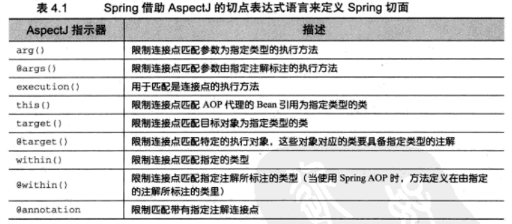
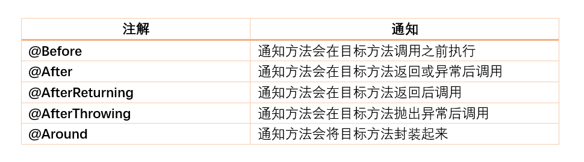
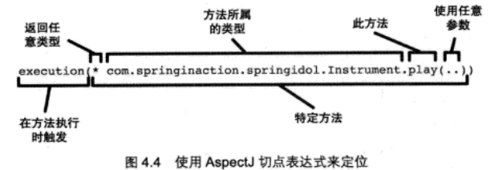
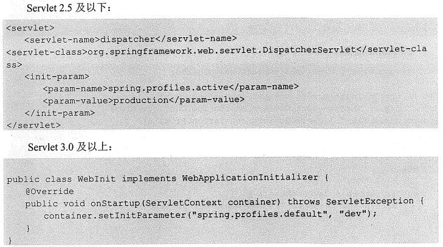
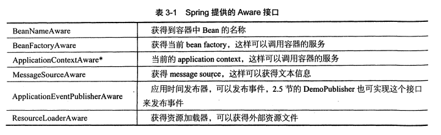
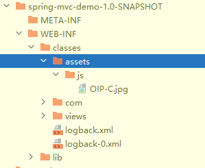
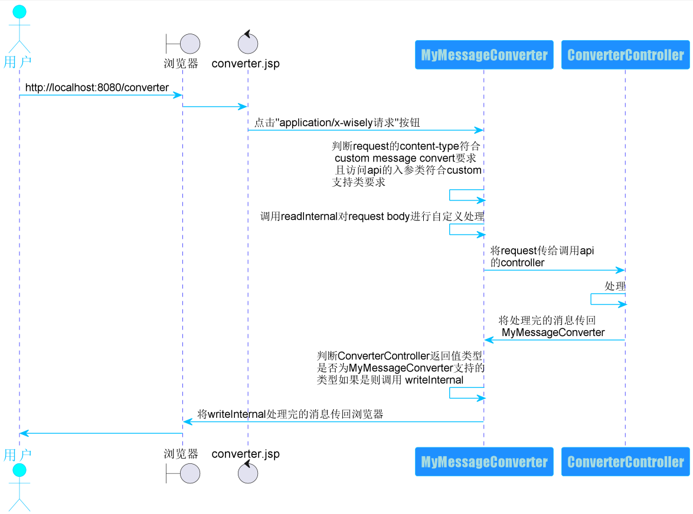

### spring-core, spring-core-demo module
#### mvn将jar包打包本地maven库
```
   mvn install:install-file -DgroupId=com.oracle -DartifactId=ojdbc14 -Dversion=1.0 -Dpackaging=jar
   -Dfile=D:\ojdbc14.jar
```
#### bean
##### spring声明bean的注解: @Component、@Service、@Repository、@Controller功能上等效
1. @Component 没有明确角色
2. @Service 业务逻辑层(service)使用
3. @Repository 数据访问层(dao)使用
4. @Controller 展现层(mvc->spring mvc)使用
##### 注入bean的注解
1. @Autowired Spring提供的注解
2. @Inject JSR-330提供的注解
3. @Resource JSR-250提供的注解
4. @Autowired、@Inject、@Resource可以注解在set方法上或属性上,一般注解在属性上更好
##### java配置
使用@Configuraiton和@Bean实现:
   1. @Configuration声明当前类是一个配置类,相当于一个Spring配置的xml文件
   2. @Bean注解在方法上,声明当前方法的返回值为一个Bean
#### pom.xml
maven的pom.xml声明一个dependency的时候,如果scope设置为了runtime,则IDEA无法在写代码时给你提示一些代码,要将其注释掉才能用
#### aop
##### aop概念
1. join point:一个method的执行或 exception的 handle,spring-aop特指method的执行
2. pointcut:匹配一个method的执行
3. 通知(Advice): 描述对那些切点进行增强,以及如何增强 
4. 切面(Aspect): 切点+通知,比如我们声明的切面类 
5. 织入(weaving): 将增强处理添加到目标对象中的过程 
6. 引入(introduction): 给目标类增加新的功能
7. pointcut expression language:匹配joint point的表达式语言

参考:
1. [spring-aop-pointcut-tutorial](https://www.baeldung.com/spring-aop-pointcut-tutorial#:~:text=A%20pointcut%20expression%20can%20appear%20as%20a%20value,by%20advice%20annotations%20to%20refer%20to%20that%20pointcut.)
2. [Spring-Aop](https://www.cnblogs.com/joy99/p/10941543.html)
##### aop切点的切入方式

1. arg: 限制joint point的方法的参数为指定类型 @Pointcut("args(com.cbf.aop.arg_example.ArgFlyInterface)")
2. @args: 限制joint point的方法的参数具有指定类型的注解 @Pointcut("@args(com.cbf.aop.arg_annotation_example.ArgFlyAnnotation)")
3. execution:
   1. 具体指某个方法的执行 @Pointcut("execution(public String com.baeldung.pointcutadvice.dao.FooDao.findById(Long))")  
   2. 通配符,任意类的具有任意参数的任意方法 @Pointcut("execution(* com.baeldung.pointcutadvice.dao.FooDao.*(..))")
   3. 特定参数的方法
   @Pointcut("execution(* *..find*(Long))")
   @Pointcut("execution(* *..find*(Long,..))")
4. this/target: 限制joint point的方法所在类是指定类型
   1. @Pointcut("target(com.cbf.aop.target_example.TargetExampleInterface)")
   2. @Pointcut("this(com.cbf.aop.this_example.ThisExampleInterface)")
   3. within不生效
5. @target/@within: 限制joint point所在方法的类具有指定类型的注解
   1. @Pointcut("@target(com.cbf.aop.target_annotation_example.TargetAnnotation)")
   2. @Pointcut("@within(com.cbf.aop.within_annotation_example.WithinAnnotation)")
6. @annotation: 限制joint point方法有指定注解
   1. @Pointcut("@annotation(com.cbf.aop.excecution.Action)")
7. 依赖
   ```
           <dependency>
               <groupId>org.aspectj</groupId>
               <artifactId>aspectjrt</artifactId>
               <version>1.8.5</version>
           </dependency>
           <dependency>
               <groupId>org.aspectj</groupId>
               <artifactId>aspectjweaver</artifactId>
               <version>1.8.5</version>
           </dependency>
   ```
##### aop的通知类型

##### aop的execution详解

#### scope
scope描述Spring容器如何新建bean实例,使用@Scope注解来实现
1. Singleton:一个Spring容器只有一个Bean实例
2. Prototype: 每次调用新建一个Bean实例
3. Request: web项目,一个http request新建一个bean实例
4. Session: 一个http session新建一个bean实例

#### 资源注入
1. 使用EL-spring表达式,可用于xml、注解中,将 普通文件、网址、配置文件、系统环境变量等注入
2. 使用springboot时,会默认加载classpath下的application.properties默认,此时可以用@Value直接获取application.properties中的属性值
3. 在@Value的参数中使用表达式
   1. @Value("${property:default_value}") 注入外部配置文件对应的property, 为空时默认值为default_value
   2. @Value("#{obj.property:default_value}") 注入SpEL表达式对应的内容,obj是对象, 为空时默认值为default_value
4. @Value例子
   1. 注入普通字符串
5. @PropertySource
   1. 用classpath指定要加载的资源文件
   2. 用file指定要加载的资源文件
   3. spring4.3之前，除了使用@PropertySource注解之外，还要手动注册一个资源文件解析器PropertySourcesPlaceholderConfigurer到IOC容器中。并且如果使用Bean注解注册资源文件解析器，方法要是static方法,不然无法解析；spring4.3之后,可以直接使用，因为spring会使用默认的DefaultPropertySourceFactory解析。
   4. 自带的资源解析器可以解析properties、xml文件
   5. 自定义实现解析yaml解析

参考: [@PropertySource详解](https://blog.csdn.net/qq_40837310/article/details/106587158)

#### bean的初始化和销毁
1. 使用@Bean的initMethod、destroyMethod
2. 使用JSR-250的@PostConstruct、@PreDestroy

#### @ComponentScan
1. 默认扫描注解类的当前包以及sub-packages
2. 指定扫描包
```
@ComponentScan(basePackages = "com.baeldung.componentscan.springapp")
```
3. 指定多个扫描包
```
@ComponentScan(basePackages = {"com.baeldung.componentscan.springapp.animals", "com.baeldung.componentscan.springapp.flowers"})
```
// spring 4.1.1开始,可以用,或;或空格分割多个包
```
@ComponentScan(basePackages = "com.baeldung.componentscan.springapp.animals;com.baeldung.componentscan.springapp.flowers")
@ComponentScan(basePackages = "com.baeldung.componentscan.springapp.animals,com.baeldung.componentscan.springapp.flowers")
@ComponentScan(basePackages = "com.baeldung.componentscan.springapp.animals com.baeldung.componentscan.springapp.flowers")
```
4. 排除包
```
// 例子1
@ComponentScan(excludeFilters = @ComponentScan.Filter(type=FilterType.REGEX,
 pattern="com\\.baeldung\\.componentscan\\.springapp\\.flowers\\..*"))

// 例子2
ComponentScan(excludeFilters = 
  @ComponentScan.Filter(type = FilterType.ASSIGNABLE_TYPE, value = Rose.class))
```
5. @SpringBootApplication也有@ComponentScan功能,因为它由三个注解组成
```  
@Configuration
@EnableAutoConfiguration
@ComponentScan
```
参考: [@ComponentScan](https://www.baeldung.com/spring-component-scanning)

#### Profile
不同环境下使用不同配置,比如dev、uat、prod的database config肯定是不同的
设置方式:
   1. environment的activeProfiles来设定当前需要的配置环境,在开发中使用@Profile注解类或方法,达到不同情况下实例化不同的bean
   2. 设定jvm的spring.profiles.active设置环境
   3. web项目设置Servlet的context parameter 
   
##### springboot里使用profile
1. 对application-{env}的影响
2. 对application.properties中的其他profile的影响
#### 事件application event
1. application event为bean与bean之间的消息通信提供了支持
2. 当一个bean-a处理完一个task之后,如果希望bean-b知道并做相应的处理,就要让bean-b监听bean-a发送的事件
使用spring event的流程:
   1. extends ApplicationEvent,自定义事件
   2. implements ApplicationListener,自定义事件监听器
   3. 使用容器发布事件

#### Spring aware
1. spring的依赖注入的一个特点就是所有bean不会感知到spring容器的存在
2. 如果你的bean要使用spring容器本身的资源时,就要感知到spring容器的存在,这就是所谓的spring aware,使用了spring aware后,bean和spring框架耦合
3. aware接口图

4. ApplicationContext继承了MessageSource接口、ApplicationEventPublisher接口、ResourceLoader接口,所以bean继承ApplicationContextAware就可以获得spirng容器所有服务;但是原则上需要什么服务就实现什么接口

#### multiThread
spring提供了对异步任务的支持
   1. config类开启异步任务支持 @EnableAsync
   2. config类实现 AsyncConfigure 接口, 重写getAsyncExecutor方法,提供自定义ThreadPoolTaskExecutor
   3. 要异步执行的方法 加上@Async
#### 计划任务
1. config类上开启对计划任务的支持 @EnableScheduling
2. 执行计划任务的方法上开启计划任务 @Scheduled
3. @Scheduled支持多种计划任务: cron、fixDelay、fixRate等  

参考: [New in Spring 5.3: Improved Cron Expressions](https://spring.io/blog/2020/11/10/new-in-spring-5-3-improved-cron-expressions)

#### 条件注解@Conditional
基于条件创建bean
1. 使用@Conditional注解+ 条件
2. 条件通过实现 org.springframework.context.annotation.Condition 接口实现
3. 例子
``` 
@Configuration
public class ConditionConfig {

    @Bean
    @Conditional(WindowsCondition.class) // 通过Conditional注解,符合Windows条件就实例化windowsListService
    public ListService windowsListService(){
        return new WindowsListService();
    }

    @Bean
    @Conditional(LinuxCondition.class) // 符合Linux条件就实例化linuxListService
    public ListService linuxListService(){
        return new LinuxListService();
    }
}

public class WindowsCondition implements Condition {
    @Override
    public boolean matches(ConditionContext conditionContext, AnnotatedTypeMetadata annotatedTypeMetadata) {
        return conditionContext.getEnvironment().getProperty("os.name").contains("Windows");
    }
}

```

#### 组合注解与元注解
spring的注解太多了,反复写多个注解是重复代码,将多个注解组合一起使用降低代码冗余
例子:组合 @Configuration 和 @ComponentScan
``` 
   @Target(ElementType.TYPE)
   @Retention(RetentionPolicy.RUNTIME)
   @Documented
   @Configuration // 组合@Configuration
   @ComponentScan // 组合@ComponentScan
   public @interface WiselyConfiguration {
       String[] value() default {}; // 覆盖value参数
       String[] basePackages() default {}; // 覆盖basePackages参数
   }
```

#### @Enable*注解工作原理
@import的使用

#### 测试
1. 单元测试很简单的通过@Test完成
2. 对于集成测试, spring通过 Spring TestContext framework来支持,可以支持 Junit或TestNG
3. Spring提供了一个SpringJUnit4ClassRunner类,提供了Spring TestContext Framework功能,
通过@Configuration配置Application context,通过@ActiveProfiles确定活动profile
4. 相关依赖
```
        <dependency>
            <groupId>org.springframework</groupId>
            <artifactId>spring-test</artifactId>
            <version>${spring-framework.verion}</version>
            <scope>test</scope>
        </dependency>
        <dependency>
            <groupId>junit</groupId>
            <artifactId>junit</artifactId>
            <version>4.13.2</version>
            <scope>test</scope>
        </dependency>
```
5. 例子
```
@RunWith(SpringJUnit4ClassRunner.class) // 1.在Junit环境下提供Spring TestContext Framework功能
@ContextConfiguration(classes = {TestConfig.class}) // 2.加载ApplicationContext, classes属性指定加载配置类
@ActiveProfiles("prod") // 3.声明活动的profiles,改为 "dev"可得到不通过的结果
public class DemoBeanIntegrationTests {
    @Autowired // 4.可使用普通的 @Autowired 来注入bean
    private TestBean testBean;

    @Test // 测试代码,通过JUnit的 Assert来校验结果是否和预期的一致
    public void prodBeanShouldInject(){
        String expected = "from production profile";
        String actual = testBean.getContent();
        Assert.assertEquals(expected, actual);
    }
}
```

#### spring项目中获取实现某个接口的所有实现类
0. 参考 spring-core-demo的 com.cbf.interface_all_implement 包
1. 使用 ApplicationContextAware
   0. 所有实现类都成为spring 管理的 bean
   1. 用一个配置类(有注解@Configuration)实现 ApplicationContextAware 的 setApplicationContext 方法,
   2. 在 setApplicationContext 方法中用 applicationContext.getBeansOfType(<interface>.class) 获得指定接口的所有实现类
2. 直接使用 @Autowired
   0. 所有实现类都成为spring 管理的 bean
   1. 在一个配置类中用下列 @Autowired 代码
```
    @Autowired
    private Map<String, SpringGetAllTestInterface> beansOfType1;
```


#### 纯java如何获取某个接口的所有实现类,使用 SPI
1. 在META-INF/services/目录下用你的接口全路径名称命名一个文件（不加后缀），然后在该文件中一行一个添加你的接口实现类的全路径名
2. 通过load方法来加载出所有的接口实现类,load()返回值是一个迭代器,用这个迭代器可以遍历出所有接口实现类
```
ServiceLoader<MyInterface> loader = ServiceLoader.load(MyInterface.class);
```
### 纯spring-mvc项目, spring-mvc-demo module
#### servlet 2.5 vs servlet 3.0对spring-mvc的影响
1. Servlet2.5及以下要在web.xml里配置<servlet>元素
2. Servlet3.0中,不需要web.xml,实现 WebApplicationInitializer就等同于web.xml配置
3. maven打war包
   1. 打包方式配置成war包
   ```
   <packaging>war</packaging>
   ```
   2. 配置war包插件
   ```
       <build>
        <plugins>
            <plugin>
                <groupId>org.apache.maven.plugins</groupId>
                <artifactId>maven-war-plugin</artifactId>
                <version>2.3</version>
                <configuration>
                    <failOnMissingWebXml>false</failOnMissingWebXml>
                </configuration>
            </plugin>
        </plugins>
    </build>
   ```
   3. 执行打包命令
   ```
   mvn clean package
   ```
4. IDEA配置spring-web项目
   1. 下载并安装Tomcat,根据jdk version、servlet version、jsp version选择[tomcat version](https://tomcat.apache.org/whichversion.html)
      选择[tomcat8,core,windows-64bit版本](https://tomcat.apache.org/download-80.cgi)
   2. tomcat需要配置JAVA_HOME
   3. tomcat的启动命令和关闭命令
      1. 启动:startup.bat, 默认会占用8080端口,如果端口被占用则需要检测被占用端口的pid,并且kill掉, 检测netstat -ano|findstr "8080", 杀死指定pid进程 taskkill /f /pid <pid>
      2. 关闭:shutdown.bat
   4. 启动之后网页输入 localhost:8080验证
   5. [IDEA配置tomcat启动](https://blog.csdn.net/sinat_34104446/article/details/85337513)
      1. run configuration选择tomcat
      2. tomcat-server选项卡配置tomcat主目录,点击右侧的configure配置
      3. tomcat-deployment选项卡 update action、on frame deactivations设置为update resources
      4. deployment 选项卡选择部署的项目和部署模式为war exploded
      5. deployment 选项卡设置 application context为 /,否则访问路径的根路径需要加上设置的字符串
      6. 设置热部署:将ocat时需要设置JMX端口,默认为1099,可能被占用导致无法启动,可以修改为2099再尝试启动
      7. 配置完成后,下方的Service栏会有对应tomcat的启动图标
   6. IDEA war部署 VS war deployment部署
      1. war模式: 将WEB工程以war包的形式部署到tomcat中
      2. war exploded模式: 将WEB工程以当前文件夹的位置关系上传到服务器,即直接把文件夹、jsp页面 、classes等等移到Tomcat 部署文件夹里面，进行加载部署。因此这种方式支持热部署,开发时一般选择这种
   7. 服务器如何在tomcat中服务war包?(database等配置文件的部署?)[参考](https://www.cnblogs.com/my_captain/p/9122812.html#:~:text=1.,%E5%BD%93%E9%83%A8%E7%BD%B2war%E5%8C%85%E5%88%B0tomcat%E6%97%B6%EF%BC%8C%E5%B0%B1%E9%9C%80%E8%A6%81%E5%B0%86jdbc.properties%E3%80%81log4j.properties%E6%8B%B7%E8%B4%9D%E5%88%B0tomcat%E7%9A%84%2Fapache-tomcat-7.0.88%2Fconf%E4%B8%8B%EF%BC%8C%E5%B0%86war%E5%8C%85%E6%8B%B7%E8%B4%9D%E5%88%B0%2Fwebapps%E4%B8%8B%202)
5. spring mvc的常用注解
   1. @Controller注解在类上:声明控制器,在spring mvc里只有@Controller才能声明控制器,@Component等不能声明控制器
   2. @RequestMapping映射web请求,可注解在类上或方法上:@RequestMapping注解在方法上的路径会继承注解在类上的路径
   3. @ResponseBody注解在方法上或返回值前:将返回值放在response体内,而不是返回一个页面,即用于返回data而不是view
   4. @RequestBody注解在参数前:允许request的参数在request体内,而不是直接放在链接地址后
   5. @PathVariable注解在参数前:用来接受路径参数,比如/news/001,可接收001作为参数
   6. @RestController注解在类上: 组合注解,组合使用@Controller、@ResponseBody,用于只需要页面交互数据,如果不使用@RestController来开发数据交互的话,就要使用@Controller注解在类上,@ResponseBody注解在对应方法上
6. 演示例子查看 DemoAnnoController、DemoRestController
   1. 对象和xml、json转换的依赖
```
<dependency>
    <groupId>com.fasterxml.jackson.dataformat</groupId>
    <artifactId>jackson-dataformat-xml</artifactId>
    <version>2.8.5</version>
</dependency>
```
   2. 如果只需要对象和json之间转换,上面依赖包含下面的依赖
```
<dependency>
    <groupId>com.fasterxml.jackson.core</groupId>
    <artifactId>jackson-databind</artifactId>
    <version>2.13.4</version>
</dependency>
```
7. 定制Spring mvc配置:例子 MyMvcConfig
方式：让配置类 继承 WebMvcConfigurerAdapter,并使用 @EnableWebMvc注解来开启对 Spring MVC的支持,然后就可以重写WebMvcConfigurerAdapter的方法来自定义配置了
   1. **配置静态资源**: 重写 WebMvcConfigurerAdapter 的 addResourceHandlers 方法   
   **访问静态资源的例子**  
   
   (1) 配置了静态资源本地存放路径为 "/assets/", 外部访问路径为 "/assets/**"
   ```
      @Override
      public void addResourceHandlers(ResourceHandlerRegistry registry) {
      super.addResourceHandlers(registry);
      // 3.addResourceLocations指的是文件放置的目录, addResourceHandler指的是对外暴露的访问路径
      registry.addResourceHandler("/assets/**").addResourceLocations("classpath:/assets/");
      }
   ```
   (2) jsp使用静态资源例子
   ```
   
   ```
   (3) 编译后的情况  
   
   2. **拦截器配置**: 
      1. Interceptor定义： 对每个请求处理前后进行相关的处理,类似 Servlet的Filter
      2. 实现方式: 
         1. 让普通bean实现 HandlerInterceptor接口 或 继承 HandlerInterceptorAdapter类来实现自定义拦截器
         2. 重写 WebMvcConfigurerAdapter 的 addInterceptors方法来注册自定义拦截器
      3. 跑起来应用后,测试 http://localhost:8080/index, 输出 "this request handling :37ms"
   3. 控制器全局配置 @ControllerAdvice
      1. 全局控制器异常处理: @ExceptionHandler  
         1.1 例子
            1. 全局异常配置,ModelAndView设置对应的异常转向页面和填入页面可以获得的key-value
            2. 异常页面
            3. 抛出异常的Controller
            4. 测试 访问: http://localhost:8080/advice
      2. 绑定请求参数到Model中: @InitBinder,用来设置 WebDataBinder, WebDataBinder可以自动绑定前台请求参数到Model中
      3. 绑定键值对到Model中: @ModelAttribute绑定键值对到Model中,让所有@RequestMapping都能获得设置的键值对
         1. 在全局配置config类中用 @ModelAttribute 注解的方法中, 用 Model设置所有@RequestMapping方法都可以获得的key-value
         2. @RequestMapping中,用 @ModelAttribute("<key>")注解对应的入参,获取前面设置的key
   4. 快捷页面转向
      1. 可用用controller的一个@RequestMapping来映射到一个页面,但是这样至少要三行代码
   ```
   @RequestMapping("/index") // 2.配置URL和方法之间的映射
   public String hello(){
      return "index"; // 3.通过之前 viewResolver的bean配置,返回值是index,说明我们的页面放置的路径为 /WEB-INF/classes/views/index.jsp
   }
   ```
      2. 在 mvc config类中重写 addViewControllers 方法可以一行配置 url 到 页面的跳转
   ```
   @Override // 配置快捷页面转向,访问url host:port/indexgo时,转向 index页面
   public void addViewControllers(ViewControllerRegistry registry){
      registry.addViewController("/indexgo").setViewName("/index"); // 一行配置跳转
   }
   ```
   5. 路径匹配参数配置
      1. 默认路径参数带".", "."后的值将被忽略
      1.1 例子,访问 url http://localhost:8080/anno/pathvar/xx.yy, 输出 "url:http://localhost:8080/anno/pathvar/xx.yy can access,str:xx"
      1.2 重写 mvcConfig类的 configurePathMatch方法可不忽略 "."后面的参数
   ```
   @Override
   public void configurePathMatch(PathMatchConfigurer configurer) {
      configurer.setUseSuffixPatternMatch(false); // 访问url时不忽略 "."后面的参数
      super.configurePathMatch(configurer);
   }
   ```
      1.3 重新访问,输出 "url:http://localhost:8080/anno/pathvar/xx.yy can access,str:xx.yy"

#### springmvc 上传文件
1. 配置 MultipartResolver 上传文件
2. 在 MultipartFil 接收文件,用 MultipartFil[] 接收多个文件
3. 配置依赖
```
        <dependency>
            <groupId>commons-fileupload</groupId>
            <artifactId>commons-fileupload</artifactId>
            <version>1.4</version>
        </dependency>
        <dependency>
            <groupId>commons-io</groupId>
            <artifactId>commons-io</artifactId>
            <version>2.7</version>
        </dependency>
```
4. 配置upload.jsp
5. 添加转向到 upload页面 的ViewController
6. 配置MultipartResolver
```
    @Bean
    public MultipartResolver multipartResolver(){
        CommonsMultipartResolver multipartResolver = new CommonsMultipartResolver();
        multipartResolver.setMaxUploadSize(1000000);
        return multipartResolver;
    }
```
7. 配置上传文件Controller
   ```
   @Controller
   public class UploadController {
   
       @RequestMapping(value = "/upload" , method = RequestMethod.POST)
       public @ResponseBody String upload(MultipartFile file){ // 1.使用MultipartFile接受上传的文件
           try {
               // 2.使用FileUtils.writeByteArrayToFile快速写文件到磁盘
               FileUtils.writeByteArrayToFile(new File("D:\\tmp\\upload-save-dir\\" + file.getOriginalFilename()),file.getBytes());
               return "upload success";
           } catch (IOException e) {
               throw new RuntimeException(e);
           }
       }
   }
   ```
8. windows本地设置一个上传文件夹,接受文件夹,测试即可, 访问url http://localhost:8080/toUpload

#### 配置跨域
重写 WebMvcConfigurerAdapter 的 addCorsMappings
```
/**
     * 跨域CORS配置
     * @param registry
     */
    @Override
    public void addCorsMappings(CorsRegistry registry) {
        super.addCorsMappings(registry);
        registry.addMapping("/**")
                .allowedHeaders("*")
                .allowedMethods("POST","GET")
                .allowedOrigins("http://...")
                .allowCredentials(true);
    }
```

#### 配置 formatter
```
@Override
    public void addFormatters(FormatterRegistry registry) {
        registry.addFormatter(new Formatter<Date>() {
            @Override
            public Date parse(String date, Locale locale) {
                return new Date(Long.parseLong(date));
            }

            @Override
            public String print(Date date, Locale locale) {
                return Long.valueOf(date.getTime()).toString();
            }
        });
    }
```
#### 自定义 HttpMessageConverter
1. spring内置了大量的HttpMessageConverter,比如 MappingJackson2HttpMessageConverter、StringHttpMessageConverter
2. 自定义 HttpMessageConverter
``` 
   /**
    * 1. 继承 AbstractHttpMessageConverter 实现自定义 HttpMessageConverter
    * @Author yingge
    * @Date 2022/9/10 9:47
    */
   public class MyMessageConverter extends AbstractHttpMessageConverter<DemoObj> {
   
       public MyMessageConverter(){
           // 2.自定义媒体类型 application/x-wisely, 指定编码为 UTF-8
           super(new MediaType("application", "x-wisely", Charset.forName("UTF-8")));
       }
   
       // 3. 重写 readInternal, 处理请求的数据, 表明将输入数据按照自定义处理方式并转成DemoObj对象
       @Override
       protected DemoObj readInternal(Class<? extends DemoObj> aClass, HttpInputMessage httpInputMessage) throws IOException, HttpMessageNotReadableException {
           String temp = StreamUtils.copyToString(httpInputMessage.getBody(), Charset.forName("UTF-8"));
           String[] tempArr = temp.split("-");
           return new DemoObj(Long.valueOf(tempArr[0]), tempArr[1]);
       }
   
       // 4.表明本 HttpMessageConverter 只处理 DemoObj这个类
       // 即当 要访问的 api 接口处理的入参类是 DemoObj 类时才调用上面的readInternal方法
       @Override
       protected boolean supports(Class<?> aClass) {
           return DemoObj.class.isAssignableFrom(aClass);
       }
   
       // 5. 重写 writeInternal, 处理如何输出数据到 response,这里是 原样输出加上"hello:"
       @Override
       protected void writeInternal(DemoObj obj, HttpOutputMessage httpOutputMessage) throws IOException, HttpMessageNotWritableException {
           String out = "hello:" + obj.getId() + "-" + obj.getName();
           httpOutputMessage.getBody().write(out.getBytes());
       }
   }
```
3. 配置 converter 跳转
   ```
   // converter 跳转页面
   registry.addViewController("/converter").setViewName("converter");
   ```
4. 配置自定义 converter 的bean, 重写 mvcConfig类的方法
   1.  configureMessageConverters方法: 重写会覆盖掉 springmvc 默认注册的多个 HttpMessageConverter
   2. extendMessageConverts方法: 仅添加一个自定义的 HttpMessageConverter,不覆盖默认注册的 HttpMessageConverter
5. 重写 extendMessageConverts方法
   ```
       // 添加自定义 MyMessageConverter
       @Override
       public void extendMessageConverters(List<HttpMessageConverter<?>> converters) {
           converters.add(converter());
           super.extendMessageConverters(converters);
       }
       @Bean
       public MyMessageConverter converter(){
           return new MyMessageConverter();
       }
   ```
6. 创建 ConverterController
``` 

```
7. 创建 converter.jsp
8. 测试,访问url http://localhost:8080/converter
   1. 访问api接口时,要判断reqeust的 content-type 和 api的@RequestMapping的 produces类型是否一致
   2. 然后是否走自定义 converter 的readInternal,还要看入参的 对象类型是否和 自定义converter指定的类型一致,入参必须用 @RequestBody注解
   3. api处理完的output是否走 converter 的 writeInternal 要看接口的返回值 类型是否和自定义converter指定的类型一致,且返回值必须使用 @ResponseBody注解
   4. 参考:[SpringMVC自定义配置消息转换器踩坑总结](https://www.cnblogs.com/fingerboy/p/7753577.html)

9. 访问流程图:  

参考: [plantuml-sequence-diagram](https://plantuml.com/sequence-diagram)
#### 服务端推送技术
1. Ajax向服务器轮询,让浏览器尽快获得消息,轮询频率不好控制,增加了服务端的压力
2. 服务端推送技术: 
   1. client向 server发送 request时, server抓住这个request不放,等有数据更新时才返回给客户端,客户端接收到消息后,再向服务端发送请求.
   2. 对比ajax轮询,降低了发送到服务器的请求数量,减少了服务器压力
3. 服务端推送实现：
   1. 基于SSE(server send event),需要新式浏览器支持
   2. 基于Servlet3.0+异步方法,跨浏览器
   3. 双向通信技术-websocket
4. SSE例子：
   1. 配置SSE控制器 SseController
   2. 配置对应jsp页面 sse.jsp
   3. 配置url到对应jsp页面的跳转
   4. 访问 url http://localhost:8080/sse 测试
5. Servlet3.0+异步方法例子
   1. 在实现了 接口 WebApplicationInitializer 的 WebInitializer 里开启对异步方法的支持
   ```
       ServletRegistration.Dynamic servlet = servletContext.addServlet("dispatcher", new DispatcherServlet(context)); // 3.注册spring mvc的 DispatcherServlet
       servlet.addMapping("/");
       servlet.setLoadOnStartup(1);
       // 开启异步方法支持
       servlet.setAsyncSupported(true);
   ```
   2. 实现异步更新service PushService, 使用 @Scheduled( fixedDelay =  5000) 定时更新
   3. 实现controller AysncController 接受api调用
   4. 实现 async.jsp页面向server端发起 ajax调用
   5. 在mvcConfig开启对 计划任务的支持 @EnableScheduling
   6. 在 mvcConfig里添加对 异步jsp的跳转支持
   7. 测试访问 url 
6. DeferredResult 使用, servlet3.0开始支持
   1. 用于对 IO密集型或长时间计算的API作为返回值,这样同时多个request到达该api时就不会阻塞
   2. 在另一个thread中对 DeferredResult 值进行真正的更新, 调用其 setResult 方法,此时客户端会收到真正的结果.
   3. 可以对一个 DeferredResult 对象注册三种回调
      1. timeout callback
   ```
   设置timeout callback
   deferredResult.onTimeout(() -> 
     deferredResult.setErrorResult(
       ResponseEntity.status(HttpStatus.REQUEST_TIMEOUT)
         .body("Request timeout occurred.")));
   // 测试timeout
   ForkJoinPool.commonPool().submit(() -> {
       LOG.info("Processing in separate thread");
       try {
           Thread.sleep(6000);
       } catch (InterruptedException e) {
           ...
       }
       deferredResult.setResult(ResponseEntity.ok("OK")));
   });
   ```
      2. error callback
   ```
   deferredResult.onError((Throwable t) -> {
     deferredResult.setErrorResult(
     ResponseEntity.status(HttpStatus.INTERNAL_SERVER_ERROR)
     .body("An error occurred."));
   });
   ```
      3. completion callback
   ```
   deferredResult.onCompletion(() -> LOG.info("Processing complete"));
   ```
   4. 参考: [Guide to DeferredResult in Spring](https://www.baeldung.com/spring-deferred-result)
7. DeferredResult VS 一般阻塞 api
   1. DeferredResult的api,假如这个api是等待10s后然后返回结果(异步等待),然后先后进入1、2两个request(时间差可忽略),结果是request 1、2都等待10s后得到响应
   2. 一般阻塞api,假如这个api是等待10s后然后返回结果(同步等待),然后先后进入1、2两个request(时间差可忽略),结果是request 1等待10s后得到响应,request 2等待20s后得到响应
   3. 所以对于文件IO类响应,最好是设置成异步api,减少累计等待时间
   4. DeferredResultExampleController的异步api "/deferred/completionCallback"、"/deferred/completionCallback",同步api "/deferred/noDeferred"

#### spring mvc测试
1. 测试驱动开发(Test Driven Development, TDD):先按照需求写一个预期结果的测试用例,刚开始是失败的测试,随着不断的编码和重构,最终让测试用例通过测试
2. 测试依赖,scope是test,说明发布的jar中不包含这些依赖包
```
        <dependency>
            <groupId>org.springframework</groupId>
            <artifactId>spring-test</artifactId>
            <version>${spring-framework.verion}</version>
            <scope>test</scope>
        </dependency>
        <dependency>
            <groupId>junit</groupId>
            <artifactId>junit</artifactId>
            <version>4.13.2</version>
            <scope>test</scope>
        </dependency>
```
3. java静态导入,IDEA不自动提示好像
4. 测试例子 TestControllerIntegrationTests

#### spring testing
[MockMvc – Spring MVC testing framework introduction: Testing Spring endpoints](https://blog.marcnuri.com/mockmvc-spring-mvc-framework#:~:text=The%20easiest%20way%20to%20run%20a%20test%20with,only%20the%20required%20components%20for%20an%20MVC%20application)
[Testing](https://docs.spring.io/spring-framework/docs/current/reference/html/testing.html#integration-testing-annotations-spring)

### springboot
#### springboot特点
1. springboot项目可以 以jar包形式独立运行: java -jar xxx.jar
2. 内嵌Servlet容器,springboot可选内嵌Tomcat、Jetty、Undertow,然后就不需要以war形式部署,直接以jar包形式部署
3. 提供 starter 简化 maven配置, starter会自动引入相应的依赖包,不再需要手动指定
4. 自动配置spring:springboot根据在类路径中jar包、类等自动配置bean,来减少需要的配置,比如引入了jdbc、mybatis等依赖,就会自动配置data source,需要提供数据库连接配置
5. 准生产的应用监控:提供基于http、ssh、telnet对运行时的项目进行监控
6. 使用注解来配置
#### @SpringBootApplication 注解
1. @Configuration、@ComponentScan：会自动扫描@SpringBootApplication所在类的同级别包
2. @EnableAutoConfiguration：根据类路径中的jar包依赖为当前项目自动配置
3. 关闭特定自动配置使用 @SpringBootApplication 的 exclude 参数
```
@SpringBootApplication(exclude = DataSourceAutoConfiguration.class)
```
4. 修改banner
   1.在src/main/sources下新建一个banner.txt
   2. 在 http://patorjk.com/software/taag 网站生成字符,然后复制粘贴到banner.txt中
   3. 关闭banner:
   ```
   new SpringApplicationBuilder(Application.class).bannerMode(Banner.Mode.OFF).run(args);
   ```
5. 全局配置文件application.properties或application.yaml,放在 src/main/sources下
   1. 对默认端口号、默认访问路径修改
   ```
   server:
     port: 9090
     servlet:
       context-path: /hello-boot //或者写成 contextPath
   ```
   2. 在application.properties或application.yaml定义的属性,直接在配置类中使用@Value("${<name>}")获取
6. start pom
   1. 官方提供的starter pom  

| 名称                                     | 描述                                                |
|----------------------------------------|---------------------------------------------------|
| spring-boot-starter                    | 核心starer,包含自动配置、日志、yaml配置文件支持                     |
| spring-boot-starter-actuator           | 准生产特特性，用于监控和管理应用                                  |
| spring-boot-starter-remote-shell       | 提供基于ssh协议的监控和管理                                   |
| spring-boot-starter-amqp               | 使用spring-rabbit来支持AMQP                            |
| spring-boot-starter-aop                | 使用spring-aop和AspectJ支持面向切面百年城                     |
| spring-boot-starter-batch              | 对Spring batch的支持                                  |
| spring-boot-starter-cache              | 对Spring cache抽象的支持                                |
| spring-boot-starter--cloud-connectors  | 对云平台(Cloud Foundry、Heroku)提供的服务提供简化的连接方式          |
| spring-boot-starter-data-elasticsearch | 对Elasticsearch的支持                                 |
| spring-boot-starter-data-gemfire       | 对分布式存储Gemfire的支持                                  |
| spring-boot-starter-data-jpa           | 对JPA的支持，包含spring-data-jpa、spring-orm和hibernate    |
| spring-boot-starter-data-mongodb       | 对mongodb的支持                                       |
| spring-boot-starter-data-rest          | 将spring data repository暴露为 REST 形式的服务             |
| spring-boot-starter-data-solr          | 对apache solr 数据检索平台的这次hi                          |
| spring-boot-starter-freemarker         | 对freemarker模板引擎的这次hi                              |
| spring-boot-starter-groovy-templates   | 对groovy模板引擎的支持                                    |
| spring-boot-starter-hateoas            | 对基于hateoas的REST形式的网络服务的支持                         |
| spring-boot-starter-hornetq            | 通过HornetQ对JMS的支持                                  |
| spring-boot-starter-integration        | 对系统继承框架spring-integration的支持                      |
| spring-boot-starter-jdbc               | 对JDBC数据库的支持                                       |
| spring-boot-starter-jersey             | 对Jersey REST形式的网络服务支持                             |
| spring-boot-starter-jta-atomikos       | 通过atomikos对分布式事务的支持                               |
| spring-boot-starter-jta-bitronix       | 通过bitonix对分布式事务的支持                                |
| spring-boot-starter-mail               | 对javax.mail的支持                                    |
| spring-boot-starter-mobile             | 对spring-mobie的支持                                  |
| spring-boot-starter-mustache           | 对mustache模板引擎的支持                                  |
| spring-boot-starter-redis              | 对redis的支持，包括spring-redis                          |
| spring-boot-starter-security           | 对security的这次hi                                    |
| spring-boot-starter-social-facebook    | 对facebook的支持                                      |
| spring-boot-starter-linkedin           | 对linkedin的支持                                      |
| spring-boot-starter-social-twitter     | 对twiter的这次hi                                      |
| spring-boot-starter-test               | 对常用测试框架 JUnit、Hamcrest、Mockito的支持，包括spring-test模板 |
| spring-boot-starter-thymeleaf          | 对Thymeleaf模板引擎的支持                                 |
| spring-boot-starter-velocity           | 对velocit模板引擎的支持                                   |
| spring-boot-starter-web                | 对web项目的支持，包括tomcat、spring-webmvc                  |
| spring-boot-starter-Tomcat             | spring boot默认容器 tomcat                            |
| spring-boot-starter-Jetty              | 使用Jetty作为Servlet容器替换Tomcat                        |
| spring-boot-starter-undertow           | 使用undertow作为Servlet容器替换Tomcat                     |
| spring-boot-starter-loggin             | Springboot默认日志框架logback                           |
| spring-boot-starter-log4j              | 支持使用Log4j日志框架                                     |
| spring-boot-starter-websocket          | 对websocket开发的支持                                   |
| spring-boot-starter-ws                 | 对sring web services的支持                            |

   2. 第三方提供的starter pom

| 名称                 | 描述     |
|--------------------|--------|
| apache Camel       | Column |
| Spring Batch(高级用法) | Column |

7. 初始化一个springboot应用的方式
   1. IDEA直接new project然后选择maven或gradle,执行编辑pom.xml或build.gradle来引入依赖即可
   2. UI https://start.spring.io/ 手动选择依赖、springboot version、java version等下载即可
   3. gradle命令行 gradle init
   4. maven命令行 mvn -B archetype:generate -DgroupId=com.mycompany.app -DartifactId=my-app -DarchetypeArtifactId=maven-archetype-quickstart -DarchetypeVersion=1.4
8. 使用xml配置,在一些特殊情况,可能必须使用xml配置,可以使用 @ImportResource来加载xml配置
   1. 新建测试xml配置文件: sample.xml, 创建了一个测试类bean
   2. 新建测试类 XMLTestService
   3. 在配置类中引入xml配置 @ImportResource(locations = "classpath:sample.xml")
   4. 启动app后, 使用context判断是否包含测试类bean: applicationContext.containsBean("XMLTestService")
9. 使用外部配置,比如修改tomcat端口号
```
java -jar xx.jar --server.port=9090
```
10. 类型安全配置类,可以用 @ConfigurationProperties(prefix="<prefix>") 指定前缀,然后把一些配置文件内容绑定到一个类上
   1. 如果要加载的配置不在默认配置文件即 application.properties中时
      1. springboot 1.5之前可以用 @ConfigurationProperties 的 locations属性指定
      2. springboot 1.5之后用 @PropertySource来指定
   2. @PropertySource默认不能解析yaml文件,所以用properties文件.
   3. 从spring4.3开始可以自定义 PropertySourceFactory 来支持yaml文件处理, YamlPropertySourceFactory

#### springboot日志配置
1. SLF4J是日志门面,使用了 门面设计模式, 可以集成各种具体日志实现,使用SLF4J需引入如下依赖
```
        <dependency>
            <groupId>org.slf4j</groupId>
            <artifactId>slf4j-api</artifactId>
            <version>1.7.30</version>
        </dependency>
```
1.1 使用 SLF4J
```
    private static final Logger logger = LoggerFactory.getLogger(Application.class);
```
1.2 门面设计模式原理,核心是门面对象Facade
   1. 门面对象知道所有子角色的功能和责任
   2. 将client发来的request委派到子系统中
   3. facade没有实际业务逻辑,不参与子系统业务逻辑实现
1.3 SLF4J的作用
   1. 假设我们系统中引入了多种中间件,然后每种中间件都有自己的日志系统,就引入了多种日志框架,如果没有SL4FJ就要维护多种日志框架
   2. 有了SL4J,不管是那种日志框架,我们在代码层面使用都只需要一样的日志代码,由SL4J来调用具体的日志系统来打印日志
   3. 具体作用就是(1)提供日志接口(2)获取具体日志对象
1.4 [SLF4J的原理](https://www.cnblogs.com/xrq730/p/8619156.html)
   1. 所有实现SL4J标准的具体日志系统都会实现org/slf4j/impl/StaticLoggerBinder.class
   2. SLF4J运行时会去加载所有的org/slf4j/impl/StaticLoggerBinder.class,然后绑定其中一个来作为具体的日志系统
   3. [classLoader原理](https://www.javatpoint.com/classloader-in-java)
1.5 [lombok简化SLF4J的日志](https://blog.csdn.net/qq_40435659/article/details/114370663)
   1. 引入lombok
   ```
           <dependency>
               <groupId>org.projectlombok</groupId>
               <artifactId>lombok</artifactId>
               <version>1.18.24</version>
           </dependency>
   ```
   2. 简化使用,用一个注解 @Slf4j即可,原理是编译器会在编译时直接操作语法树增加节点,即增加下面代码
   ```
   private static final Logger logger = LoggerFactory.getLogger(Application.class);
   ```
1.6 但是注意,springboot的 spring-boot-starter-web 自动引入了 spring-boot-starter-logging,其引入了如下依赖,所以就不需要手动引入 SLF4J、logback、log4j-to-Slf4j依赖了
   1. SL4FJ
   2. Logback
   3. og4j-to-Slf4j
2. logback日志系统需要引入以下依赖
```

```
2.1 logback.xml,放到springboot的 src/main/resources下自动生效,注意配置 logback_home时的 windows路径, 双斜杠,否则会报找不到路径的错
```
<?xml version="1.0" encoding="UTF-8"?>
<configuration debug="false">
    <!--定义日志文件的存储地址 勿在 LogBack 的配置中使用相对路径-->
    <!--注意这里定义windows文件路径时,要用双反斜杠-->
    <property name="LOG_HOME" value="D:\\tmp\\"/>
    <!-- 定义日志格式  -->
    <property name="LOG_PATTERN" value="%d{yyyy-MM-dd HH:mm:ss.SSS} [%-5level] [%thread] [%-30.30logger{30}] %msg%n"/>
    <!-- 控制台输出 -->
    <appender name="CONSOLE" class="ch.qos.logback.core.ConsoleAppender">
        <encoder class="ch.qos.logback.classic.encoder.PatternLayoutEncoder">
            <!--格式化输出：%d表示日期，%thread表示线程名，%-5level：级别从左显示5个字符宽度%msg：日志消息，%n是换行符-->
            <pattern>%d{yyyy-MM-dd HH:mm:ss.SSS} [%thread] %-5level %logger{50} - %msg%n</pattern>
        </encoder>
    </appender>
    <!-- 按照每天生成日志文件 -->
    <appender name="FILE" class="ch.qos.logback.core.rolling.RollingFileAppender">
        <rollingPolicy class="ch.qos.logback.core.rolling.TimeBasedRollingPolicy">
            <!--日志文件输出的文件名-->
            <FileNamePattern>${LOG_HOME}/SpringBoot-Slf4j_%d{yyyy-MM-dd}.log</FileNamePattern>
            <!--日志文件保留天数-->
            <MaxHistory>30</MaxHistory>
        </rollingPolicy>
        <encoder class="ch.qos.logback.classic.encoder.PatternLayoutEncoder">
            <!--格式化输出：%d表示日期，%thread表示线程名，%-5level：级别从左显示5个字符宽度%msg：日志消息，%n是换行符-->
            <pattern>%d{yyyy-MM-dd HH:mm:ss.SSS} [%thread] %-5level %logger{50} - %msg%n</pattern>
        </encoder>
        <!--日志文件最大的大小-->
        <triggeringPolicy class="ch.qos.logback.core.rolling.SizeBasedTriggeringPolicy">
            <MaxFileSize>10MB</MaxFileSize>
        </triggeringPolicy>
    </appender>

    <!-- 日志输出级别 -->
    <logger name="org.springframework" level="INFO"/>
<!--    <logger name="com.hl.magic" level="INFO"/>-->
    <root level="DEBUG">
        <appender-ref ref="CONSOLE"/>
        <appender-ref ref="FILE"/>
    </root>
</configuration>
```
#### spring profile配置
1.默认引入application.properties或application.yaml
2.可选引入application-{env}.properties或application-{env}.yaml; 在application.properties设置 "spring.profiles.active={env}"或 -Dspring.profiles.active={env}
```
spring:
  profiles:
    active: db
```
2.1 可在 application.yaml 中配置多个profile,通过 在application.properties设置 "spring.profiles.active={env}"或 -Dspring.profiles.active={env} 激活其中一个, 好像有点问题
```
---
spring:
  profiles: dev
  cbf:
    name: "cbf-dev"

---
spring:
  profiles: uat
  cbf:
    name: "cbf-uat"

---
spring:
  profiles: prod
  cbf:
    name: "cbf-prod"

```
3.在一个配置文件中引入其他配置文件,比如加载 application-db.yml 时同时加载 application-config-a.yml、application-config-b.yml,注意引入的这两个yml名字都是 application-<name>.yaml
```
spring:
  profiles:
    include:
      - config-a
      - config-b
```
3.1 注意spring.profiles.include在 springboot 2.4版本及以上好像有问题,2.3.12.RELEASE 版本无问题
#### CommandLineRunner
0.作用: 在应用启动后，`去执行相关代码逻辑`，且只会执行一次,run()方法里使用任何依赖，因为它们已经初始化好了
1.使用:bean实现接口
   1.实现接口java类 + @Component/@Service等
   2.实现接口java类 + @Bean
2.指定多个实现CommandLineRunner接口类执行顺序 @Order(value=<number>), @order的value属性值越小优先级越高
2.1 java config(@Configuration + @Bean)的方式配置多个 CommandLineRunner,再使用@Order配置启动顺序时,@Order不生效


#### Thymeleaf
1. springboot自动集成了Thymeleaf, org.springframework.boot.autoconfigure.thymeleaf包对Thymeleaf进行自动配置
2. ThymeleafProperties配置了 Thymeleaf 在 application.properties中 配置选项,其源码
```
@ConfigurationProperties(
    prefix = "spring.thymeleaf"
)
public class ThymeleafProperties {...}
```
2. 默认情况下,springboot中的静态文件放到 src/main/resources/static下,页面放到 src/main/resources/templates
   1. [thymeleaf文档](https://www.thymeleaf.org/doc/tutorials/3.0/usingthymeleaf.html)

### springboot数据访问
